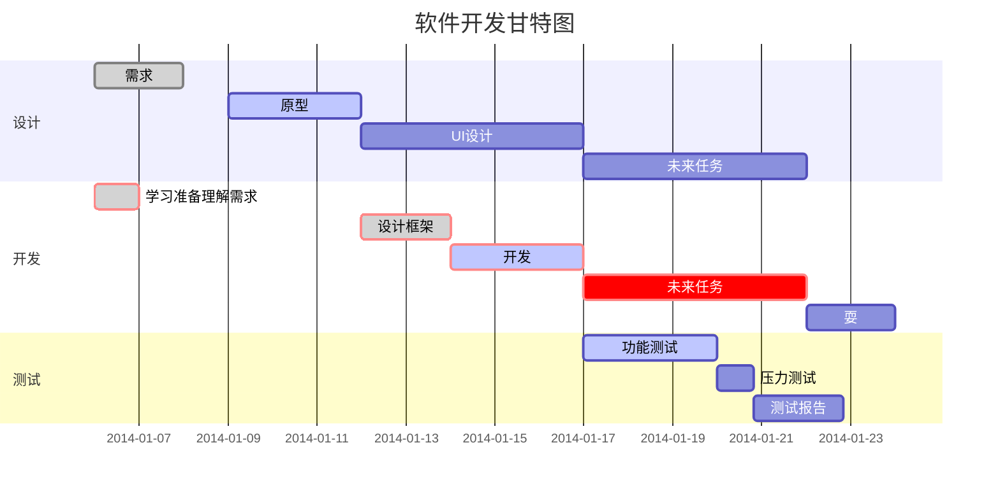

# Second
JAVA第二次实验
# 计G201+2020322060+王菲钰
# 实验名称 
### 学生选课模拟系统
## 实验目的
1.掌握定义类中属性以及方法和面向对象的类设计  
2.了解Super()关键词以及使用实例化对象  
3.掌握类的继承关系，学会通过构造方法实例化对象  
4.掌握使用Object根类的tostring（）方法，并会在相关对象的信息输出中。  
## 实验要求
1.建立People类，并建立Teacher和Student类继承People类  
2.建立Course类，通过类名定义变量调用tostring（）方法输出  
3.建立测试类，实例化老师，学生，课程  
4.模拟学生选课操作、打印课程信息  
5.模拟学生退课操作，再打印课程信息  
## 实验内容

